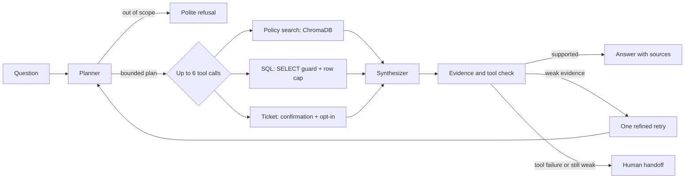
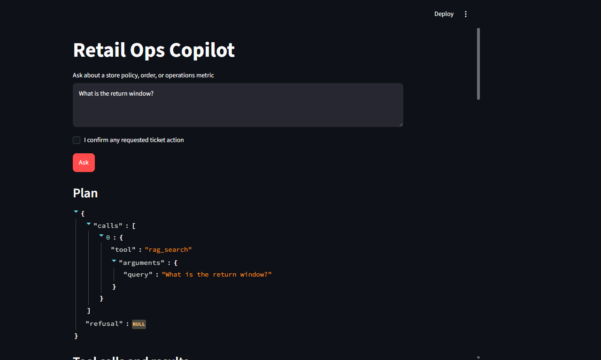
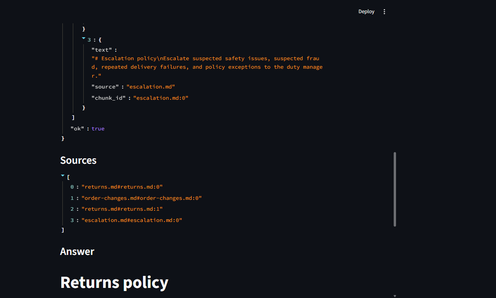

# ops-copilot

**A safety-first retail operations assistant built with LangGraph.** It can look up store policy, answer questions from synthetic order data, and prepare a support ticket only after explicit confirmation. Every response shows the plan, tool results, and evidence used.

This is a portfolio project for demonstrating practical agent engineering: tool selection, retrieval, guarded SQL, action controls, human handoff, automated evaluation, and a repeatable local development setup. It uses synthetic data and is not intended for production customer information.

## At a glance

| | |
|---|---|
| **Agent framework** | LangGraph |
| **API and UI** | FastAPI, Streamlit |
| **Retrieval** | ChromaDB + SentenceTransformers (`all-MiniLM-L6-v2`) |
| **Data** | SQLAlchemy, SQLite locally, PostgreSQL in Docker Compose |
| **Model integration** | Deterministic mock by default; OpenAI-compatible API for real use |
| **Quality checks** | pytest, Ruff, 50-question evaluation set, GitHub Actions |

## The problem

Store operations questions often cross boundaries. A manager may need a return rule from a policy document, an order status from a database, or a handoff to a human. A general-purpose chatbot can answer without evidence or take an action too early.

`ops-copilot` demonstrates a constrained alternative. It chooses from three tools, validates their inputs, keeps SQL read-only and row-limited, requires two gates before ticket creation, cites the evidence it used, and hands off when it cannot support an answer.

## How a request moves through the agent



The synthesizer formats tool outputs instead of generating unsupported factual claims. Policy results include the source document and chunk ID; SQL results include the executed, guarded SQL. See [the architecture notes](docs/architecture.md) for more detail.

### Streamlit demo

These local mock-mode screenshots show the planned tool call, returned tool evidence, and cited sources.





### The three tools

1. **`rag_search`** retrieves passages from seven synthetic store policies covering returns, shipping, warranty, escalation, order changes, price matching, and privacy.
2. **`sql_query`** accepts one `SELECT`, rejects write operations, comments, and multiple statements, adds a maximum 100-row limit, and uses a short database timeout. Docker Compose connects the API as a PostgreSQL read-only role.
3. **`create_ticket`** is a local webhook-style mock. It requires both request-level `confirm=true` and `ALLOW_TICKET_ACTIONS=true`; it is disabled by default.

## Try it locally

Python 3.11 is required. The commands below use the project virtual environment directly, so no activation step is needed.

**PowerShell (Windows)**

```powershell
python -m venv .venv
.venv\Scripts\python.exe -m pip install -e ".[dev]"
.venv\Scripts\python.exe -m app.seed
.venv\Scripts\uvicorn.exe app.api:app --reload
```

**macOS or Linux**

```sh
python3 -m venv .venv
.venv/bin/python -m pip install -e ".[dev]"
.venv/bin/python -m app.seed
.venv/bin/uvicorn app.api:app --reload
```

The mock planner and SQLite database work without an API key. The first policy search downloads the SentenceTransformers model if it is not cached. Open [http://localhost:8000/docs](http://localhost:8000/docs) to call the API. To launch the visual interface in another terminal:

```sh
# Windows: .venv\Scripts\streamlit.exe run ui/streamlit_app.py
# macOS/Linux:
.venv/bin/streamlit run ui/streamlit_app.py
```

The Streamlit UI shows the plan, each tool result, citations, confidence, and any human handoff. To launch the API, PostgreSQL, and UI together with Docker, run `docker compose up --build` (or `make docker-up`). The UI is served on port 8501 and the API on port 8000.

## Example API request

```sh
curl -X POST http://localhost:8000/ask \
  -H "Content-Type: application/json" \
  -d '{"question":"What is the return window?","confirm":false}'
```

`POST /ask` returns the answer, structured plan, tool results, sources, confidence, and `handed_off`. `GET /health` reports service health. Invalid requests receive `422`; assistant or data-tool failures receive `503`.

## Evaluation

The JSONL dataset has 50 labeled questions: 15 RAG-only, 15 SQL-only, 10 multi-step, 5 action, and 5 out-of-scope or adversarial examples. Twelve are marked `holdout`. Use the development split to make prompt changes; run the complete set after choices are fixed.

Run the checks and evaluation from the repository root. Use the virtual-environment executables so this works on a clean machine without global installs.

```powershell
.venv\Scripts\ruff.exe check .
.venv\Scripts\pytest.exe -q
.venv\Scripts\python.exe -m app.seed
.venv\Scripts\python.exe -m eval.run_eval
```

```sh
.venv/bin/ruff check .
.venv/bin/pytest -q
.venv/bin/python -m app.seed
.venv/bin/python -m eval.run_eval
```

The harness reports tool-routing accuracy, SQL result-set accuracy against reference SQL, RAG Recall@4 against labeled source files, faithfulness, abstention/handoff, end-to-end success, graph steps, latency percentiles, and cost per query. It saves JSON and Markdown under [`eval/results/`](eval/results/). In mock mode, faithfulness uses a deterministic lexical proxy and cost is $0. In real-provider mode, faithfulness uses an LLM judge; set the optional model token-price variables to estimate cost.
The runner evaluates all development cases before the 12 holdout cases. Its JSON output includes per-case outcomes and failure categories, but not question text.

### Recorded mock run

These figures come from the run saved in `eval/results/mock.json` on 2026-10-09. They describe the deterministic mock planner and local synthetic dataset, not a live model or production workload.

| Metric | Mock result |
|---|---:|
| Tool-routing accuracy | 0.98 |
| SQL execution accuracy (25 labeled cases) | 1.00 |
| RAG Recall@4 (25 labeled cases) | 0.96 |
| Faithfulness (lexical proxy) | 0.7888 |
| Correct abstention / handoff | 0.98 |
| End-to-end success | 0.96 |
| Average graph steps | 3.90 |
| p50 / p95 latency | 19.99 ms / 23.62 ms |
| Cost per query | $0.00 |

| Baseline | Tool-routing accuracy | Other result |
|---|---:|---:|
| Mock plain LLM, no tools | 0.10 | — |
| Mock RAG-only | 0.30 | Recall@4: 0.96 |
| Mock full agent | 0.98 | End-to-end: 0.96 |

The baselines are intentionally lightweight deterministic comparisons, not separate model calls. Treat these scores as a reproducible engineering smoke evaluation, not a statistically rigorous benchmark.

### Recorded real OpenRouter run

These are the results from `eval/results/real.json`, recorded on 2026-10-09 with `openai/gpt-4o-mini` through OpenRouter. The 38 development cases ran first and the 12 holdouts ran last; no prompt or routing changes were made after seeing the holdout results.

| Metric | Real result |
|---|---:|
| Tool-routing accuracy | 0.38 |
| SQL execution accuracy (25 labeled cases) | 0.00 |
| RAG Recall@4 (25 labeled cases) | 0.96 |
| Faithfulness (LLM judge) | 0.488 |
| Correct abstention / handoff | 0.38 |
| End-to-end success | 0.10 |
| Average graph steps | 3.46 |
| p50 / p95 latency | 1,256.75 ms / 2,353.87 ms |
| Tokens (prompt / completion) | 52,054 / 1,554 |
| Cost per query | Not reported (token prices were not configured) |

| Split | Queries | Tool routing | Correct handoff | End-to-end success |
|---|---:|---:|---:|---:|
| Development | 38 | 0.3684 | 0.3684 | 0.1053 |
| Holdout (final) | 12 | 0.4167 | 0.4167 | 0.0833 |

The live-model run performed substantially worse than the deterministic mock. The failure log describes the routing refusals, SQL schema mismatches, and the one labeled source missed by retrieval. RAG recall is measured separately from whether the planner actually invoked the retrieval tool. Faithfulness is an LLM-judge score, not a human-validated factuality rate.

## Safety and engineering choices

- **Offline by default:** a deterministic mock planner keeps the main flow testable without credentials. Real planning uses an OpenAI-compatible chat API; OpenRouter is the example default.
- **Read-only data path:** the guard enforces a single bounded `SELECT`; PostgreSQL runs through a role granted `SELECT` only. SQLite is used for quick local setup.
- **Confirmed actions:** ticket creation needs both user confirmation and an explicit environment opt-in. A missing confirmation produces a request to confirm without firing the action.
- **Bounded work:** tool inputs use Pydantic models, tool calls have timeouts, and a turn can execute at most six tool calls. Weak evidence gets one refined retry; tool failures or a second weak result hand off.
- **Visible evidence:** each policy result has a document and chunk identifier; SQL results expose the exact guarded query. Retrieved text is treated as data and never as agent instructions.
- **Synthetic data:** the policies and 250 generated orders are invented for this demo. No company or customer records are included.

The verifier checks tool success and evidence presence; it is not a formal proof of factual correctness. The mock planner maps common retail phrases to fixed example SQL rather than doing general-purpose text-to-SQL. The ticket service is a mock endpoint. These are deliberate portfolio-sized trade-offs, not production-ready controls.

## Configuration

Copy `.env.example` to `.env` if you want to change defaults. `.env` is ignored by Git; never put credentials in source control.

| Variable | Purpose | Default |
|---|---|---|
| `LLM_PROVIDER` | `mock` or a real OpenAI-compatible provider | `mock` |
| `OPENAI_API_KEY` | Provider credential | placeholder only |
| `OPENAI_BASE_URL` | OpenAI-compatible endpoint | OpenRouter URL |
| `LLM_MODEL` | Provider model name | `openai/gpt-4o-mini` |
| `DATABASE_URL` | SQLAlchemy connection | `sqlite:///data/ops.db` |
| `CHROMA_PATH` | Persistent Chroma directory | `.chroma` |
| `TICKET_WEBHOOK_URL` | Ticket endpoint | local mock endpoint |
| `ALLOW_TICKET_ACTIONS` | Enable the action after confirmation | `false` |
| `MODEL_INPUT_COST_PER_1M` | Input price in USD for evaluation cost estimate | unset |
| `MODEL_OUTPUT_COST_PER_1M` | Output price in USD for evaluation cost estimate | unset |

## Project layout

```text
app/                  LangGraph, schemas, planner, guards, tools, FastAPI
ui/                   Streamlit application
data/policies/        Seven synthetic operating policies
data/seed.sql         PostgreSQL schema, seed data, read-only role
eval/                 50 labeled questions, judges, runner, results, failure log
tests/                SQL guard, tool, graph, and API tests
docs/                 Architecture explanation and Mermaid diagram
.github/workflows/    CI and mock evaluation artifact workflow
.vscode/              Editor settings and launch configurations
Dockerfile            Container image
docker-compose.yml    PostgreSQL, API, and UI services
Makefile              Common development commands
```

## Run with real model credentials

1. Copy `.env.example` to `.env` and set `LLM_PROVIDER` to a non-`mock` value.
2. Add `OPENAI_API_KEY`, `OPENAI_BASE_URL`, and `LLM_MODEL` for your OpenAI-compatible provider.
3. Run `python -m eval.run_eval` and inspect the generated result files.
4. Update the README results only with output from that real run, and add any observed failures to `eval/FAILURES.md`.

## Deploy to Azure Container Apps

1. Create an Azure Container Apps environment and Azure Container Registry.
2. Build and push the reviewed image to the registry.
3. Provision managed PostgreSQL and apply the schema using a dedicated read-only application role.
4. Create the Container App with API ingress and configure its health probe for `/health`.
5. Store provider credentials and database connection strings in Azure Key Vault, then reference them as Container App secrets.
6. Configure network access, logs, monitoring, and an approved ticket webhook before enabling actions.

## Render demo deployment

The root `render.yaml` defines separate free Docker web services for the API and Streamlit UI. The API seeds its synthetic SQLite database at startup, and the policy embedding model and index are prepared in the image. The UI connects to the API using Render's service-host reference. The deployment uses the mock LLM and keeps ticket actions disabled; no provider key is required.

**Live demo:** [Open the Streamlit UI](https://ops-copilot-ui-wwyq.onrender.com/). Smoke-tested with “What is the return window?”; the page displayed the `rag_search` plan, tool output, and `returns.md` evidence. The [API health check](https://ops-copilot-api-x840.onrender.com/health) returns `{"status":"ok"}`.

Both services use Render's **Free** plan. Free services spin down after inactivity, so a request may take 50 seconds or more while the instance wakes; local filesystems are ephemeral, and the API is public because Free services do not support private networking. This setup is for a portfolio demo with synthetic data, not production use; SQLite contents are reseeded after restarts.

## GitHub

Create an empty repository, then from this project folder run the following commands (replace the username):

```sh
gh repo create YOUR_GITHUB_USERNAME/ops-copilot --public
git remote add origin https://github.com/YOUR_GITHUB_USERNAME/ops-copilot.git
git branch -M main
git push -u origin main
```
