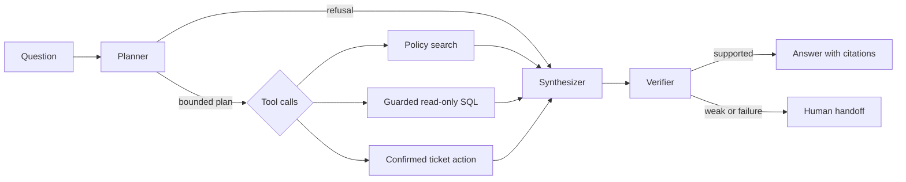

# ops-copilot

An example retail business-operations assistant built with LangGraph. It routes a question to policy search, bounded read-only SQL, or a confirmed ticket action, then checks the evidence before answering. It is designed for learning and local experiments, not production customer data.

## What it solves

Store teams often need to look up an operating rule, inspect order data, or ask a manager to intervene. This project demonstrates how to combine those tasks while keeping writes out of the SQL path, requiring confirmation for ticket creation, and showing the evidence behind an answer.

## Architecture



See [docs/architecture.md](docs/architecture.md) for notes about the flow.

## Quick start

From the `ops-copilot` folder, run these commands:

```powershell
python -m venv .venv
python -m pip install -e ".[dev]"
python -m app.seed
uvicorn app.api:app --reload
```

These commands work in PowerShell, macOS, and Linux shells. The defaults use a deterministic mock planner and a local SQLite dataset, so `.env` is optional for the quick start. To add settings, copy `.env.example` to `.env` with your platform's copy command and edit it. Open `http://localhost:8000/docs` to try `/ask`. Start the optional UI in a second terminal with `streamlit run ui/streamlit_app.py`. Policy search uses ChromaDB and the `all-MiniLM-L6-v2` SentenceTransformers model, which may need to download its model the first time it runs.

## Environment variables

| Variable | Purpose | Default |
|---|---|---|
| `LLM_PROVIDER` | `mock` or the OpenAI-compatible provider | `mock` |
| `OPENAI_API_KEY` | API key for real model use | placeholder in `.env.example` |
| `OPENAI_BASE_URL` | OpenAI-compatible endpoint | OpenRouter URL |
| `LLM_MODEL` | Provider model identifier | `openai/gpt-4o-mini` |
| `MODEL_INPUT_COST_PER_1M` | Input token price for real evaluation estimates in USD | unset |
| `MODEL_OUTPUT_COST_PER_1M` | Output token price for real evaluation estimates in USD | unset |
| `DATABASE_URL` | SQLAlchemy database connection | local SQLite unless set |
| `CHROMA_PATH` | Persistent vector store directory | `.chroma` |
| `TICKET_WEBHOOK_URL` | Ticket action endpoint | local mock endpoint |
| `ALLOW_TICKET_ACTIONS` | Explicitly enable action requests | `false` |

## Tests and evaluation

Run `pytest -q` and `ruff check .`. Run `python -m app.seed` to recreate the synthetic local database, then `python -m eval.run_eval` for the mock evaluation. Twelve dataset entries are marked `holdout`; prompts should be developed using the `dev` split and holdout results interpreted only after prompt choices are fixed.

The table below is from a local run of `python -m eval.run_eval` in mock mode on 2026-10-09 (50 questions, including 12 labeled holdouts). Mock faithfulness uses a deterministic lexical proxy; a configured real provider uses an LLM judge. Mock mode has no API cost.

| Metric | Result |
|---|---|
| Tool routing accuracy | 0.98 |
| SQL execution accuracy (25 cases) | 1.00 |
| RAG Recall@4 (25 cases) | 0.96 |
| Faithfulness (mock lexical proxy) | 0.7888 |
| Correct abstention / handoff rate | 0.98 |
| End-to-end success rate | 0.96 |
| Average graph steps | 3.90 |
| p50 / p95 latency | 19.99 ms / 23.62 ms |
| Cost per query | $0.00 (mock) |
| Plain LLM no-tools routing accuracy | 0.10 |
| RAG-only routing accuracy / Recall@4 | 0.30 / 0.96 |
| Full agent routing / end-to-end success | 0.98 / 0.96 |

Evaluation artifacts are written under `eval/results/`. Set both model pricing variables to calculate real-provider token cost estimates. The simple baseline comparison is deterministic and does not make a separate model call; treat it as a portfolio demonstration.

## Design decisions and trade-offs

- The mock planner is intentionally deterministic so tests and CI work without credentials. The real planner uses an OpenAI-compatible chat API.
- SQL is rejected unless it is a single SELECT, and results are limited to 100 rows. SQLite is used for the one-command local setup; Docker Compose provides PostgreSQL for integration work.
- Policy chunks are indexed locally by ChromaDB. Initial SentenceTransformers model setup may download model weights.
- A ticket action requires both a per-request `confirm=true` and `ALLOW_TICKET_ACTIONS=true`; the endpoint must itself be configured and trusted.
- The verifier checks tool success and that evidence was returned before accepting a response. The synthesizer formats raw tool output, which avoids adding unsupported generated claims, but this is not a proof of factual correctness.

## Known limitations

The mock planner maps common retail terms to fixed safe example queries; it is not a semantic SQL planner. The ticket endpoint is a local mock, and actions are disabled by default. PostgreSQL role creation in `data/seed.sql` uses a demo password that must be changed for any shared environment. Chroma model setup can be slow on first launch. Production use needs authentication, stronger query allowlists, rate limits, monitoring, privacy review, migrations, and security testing.

## Project structure

```text
app/                 graph, schemas, planner, API, safety guard, tools
data/policies/       synthetic store policies
data/seed.sql        PostgreSQL schema and generated synthetic rows
eval/                labeled questions, evaluator, judge, results
tests/               SQL, tool, graph, and API checks
ui/                  Streamlit interface
docs/                architecture notes
.github/workflows/   CI and mock evaluation workflows
```

## Deploy to Azure Container Apps

1. Create an Azure Container Apps environment and an Azure Container Registry.
2. Build and push the Docker image to the registry from a reviewed commit.
3. Provision managed PostgreSQL and apply the schema with a dedicated read-only application role.
4. Create the Container App using the image and configure ingress for the API.
5. Store provider keys and connection strings in Azure Key Vault and reference them as secrets.
6. Configure health probes for `/health`, network access to PostgreSQL, and logging/monitoring.
7. Keep ticket actions disabled until a secured webhook and explicit operational approval process exist.

## GitHub

The repository is ready for GitHub. After creating an empty repository, use the commands printed at the end of the build summary to add its remote and push. No remote push is performed by this project setup.
