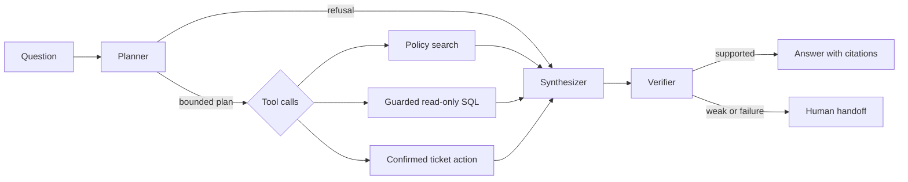

# Architecture

The graph has a hard six-call cap. SQL is validated and row-limited before execution. Ticket actions require both request confirmation and an explicit configuration opt-in. Retrieved policy text is evidence only; it cannot change planner instructions.
